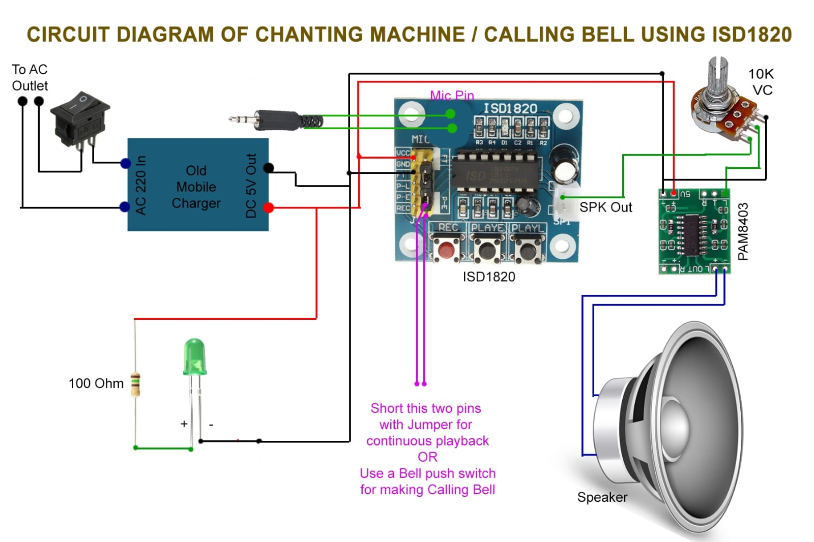

# Low-Cost BigMack Alternative Device

## Overview
This project is a low-cost alternative to the **AbleNet BigMack** communication device, designed by the **GEC Thrissur Ideator student team** for the **National Institute of Physical Medicine and Rehabilitation (NIPMER)**. The device allows individuals with speech impairments to communicate using a single pre-recorded message.

## Features
- **Single Message Storage**: Stores and plays a single **10-second message** using the **ISD1820** voice recorder module.
- **Capacitive Touch Activation**: Ensures **easy access** for individuals with limited motor skills.
- **Amplified Audio Output**: Provides **clear and loud playback** for better communication.
- **Rechargeable Power Supply**: Uses a **Li-ion battery with a charging circuit** for portability.
- **Compact and Durable Design**: Designed for **daily use** with flexible mounting options.

## Components Used
- **ISD1820 Voice Recorder Module**
- **Capacitive Touch Switches**
- **Audio Amplifier Circuit**
- **Speaker**
- **Li-ion Battery with Charging Circuit**
- **PCB and Enclosure**

## How It Works
1. **Record a Message**: Hold the **record button** on the ISD1820 module to store a 10-second message.
2. **Playback**: Press the **capacitive touch switch** to play the recorded message.
3. **Amplified Audio**: The amplifier circuit ensures **clear and loud playback**.
4. **Portable Power Supply**: The **rechargeable Li-ion battery** provides continuous power.

## Setup Instructions

1. Assemble all components as per the **circuit diagram**.

2. Record a message using the **ISD1820 module**.
3. Press the **capacitive touch switch** to play the message.
4. Charge the **Li-ion battery** as needed.

## Future Enhancements
- **Adjustable Volume Control**
- **Multiple Message Storage** (if needed in future versions)
- **Alternative Activation Methods** (for better accessibility)

## Contributors
- **GEC Thrissur Ideator student team**

## License
This project is open-source under the **MIT License**. Feel free to contribute and improve the design!

## Contact
For any queries or contributions, reach out via:

- **Lalgy Gopi (Staff Mentor)**: 9895742522
- **Athul S (Student Mentor)**: 8921353024
- **Aysha PT (Convenor - IDEATOR GECT)**: 9400020372, [ptaysha29@gmail.com](mailto:ptaysha29@gmail.com)
- **Navadeep C K**: [navadeepck@gmail.com](mailto:navadeepck@gmail.com)

